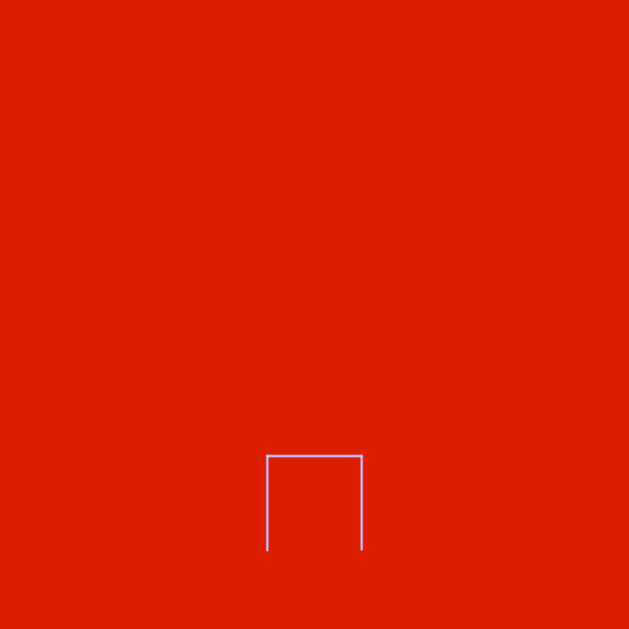
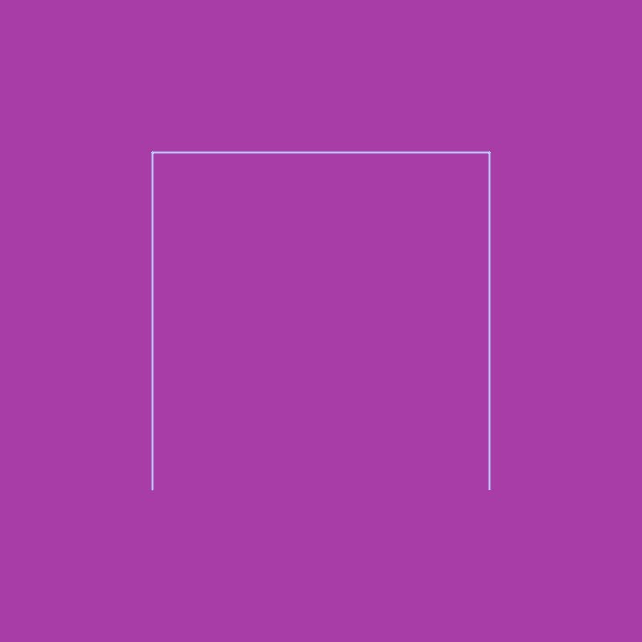
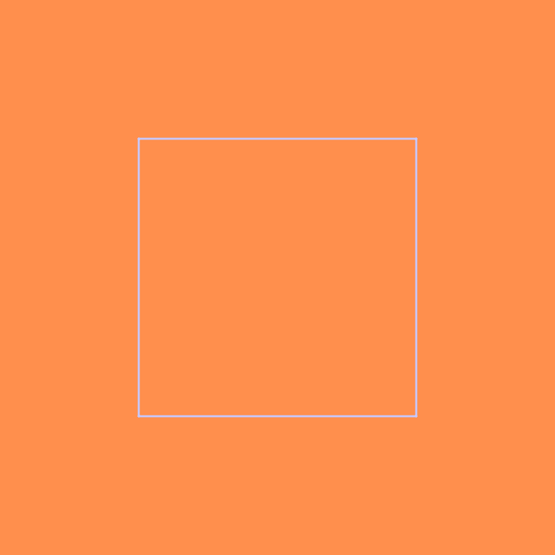

# Fractals

This is a small project that implements some fractals.

A fractal is a simple idea based on recursion. When we generate images from them, the results are really cool. Check them out:

| **Koch snowflake**  | **Pythagoras Tree**  |
|:-----------------------:|:------------------:|
| **Hilbert space-filling curve**  | **T-square**  |

## Running

Assuming you have installed the [Haskell Tool Stack](https://docs.haskellstack.org/en/stable/README/), you can launch the REPL (`stack ghci fractals:lib`) on the root of the repository. Then, if you are on terminal supported by [`sixel`](https://hackage.haskell.org/package/sixel), you can:

```haskell
-- Show 7 iterations of the Koch snowflake
mapM_ putSixel [snowflake n white blue | n <- [1..7]]

-- Show 12 iterations of the Pythagoras tree
mapM_ putSixel [tree 0.5 340 120 n white red | n <- [1..12]]

-- Show 7 iterations of the Hilbert space-filling curve
mapM_ putSixel [spaceFillingCurve (50, 750) 700 n white magenta | n <- [1..7]]

-- Show 7 iterations of the T-square fractal
mapM_ putSixel [square (400, 400) 400 n white orange | n <- [1..7]]
```

Playing with the parameters can lead to interesting results. For instance, you can make the tree to grow sideways or even be a little more realistic with a few tweaks (e.g., change the factor every _x_ iterations).

Running main is as is simple as: `stack build --exec fractals-exe`. It'll show an iteration of each fractal.
